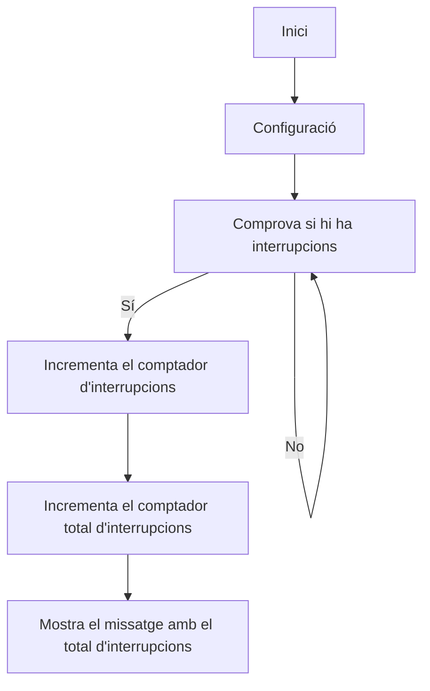

# Practica_2_Interrupcions
**Alumne:** Bernat Rubiol


El objetivo de la practica es comprender el funcionamiento de las interrupciones.

Para lo cual realizaremos una practica  donde controlaremos  2 leds  de una forma periódica  y una entrada ; de forma que el uso de la entrada provoque un cambio de frecuencia de las oscilaciones  pero solo en un led.


## Introducción teórica  

¿Qué es una interrupción hardware?

A un nivel básico, una interrupción es una señal que interrumpe la actividad normal de nuestro microprocesador y salta a atenderla. Hay tres eventos que pueden disparar una interrupción:

 
* Un evento hardware, previamente definido.
* Un evento programado, o Timer
* Una llamada por software.
 
Cuando un evento dispara una interrupción, la ejecución normal del micro se suspende (ordenadamente para poder volver) y salta a ejecutar una función especial que llamamos Interrupt Service Handler o ISH (Servicio de gestión de interrupción).

Cuando el ISH finaliza, el procesador vuelve tranquilamente al punto donde lo dejó y sigue con lo que estaba como si no hubiese pasado nada.

 
 El concepto de interrupción nace de la necesidad imperiosa de reaccionar de forma inmediata en respuesta a un acontecimiento electrónico fulgurante, que no admite demora. Bien sea por la urgencia del suceso o porque algo se podría perder de forma irrecuperable sino reaccionamos con suficiente presteza.
 

Pero ¿Qué hay tan urgente que no pueda esperar? ¿Es que nuestros procesadores  no son lo suficientemente rápidos para ver cada poco si hay una señal de alarma? ¿Por qué complicarnos la vida con una cosa tan extravagante?

La respuesta como siempre es… depende. Nuestro procesador puede estar liado y solo leerá la señal de un pin de tanto en tanto. Y si la señal que aparece se desvanece antes de que hayamos ido a ver, ni siquiera lo sabremos, porque aunque los procesadores son rápidos una señal electrónica lo es varios millones de veces más. Este es otro motivo por el que usar delays tiene mucho peligro.

 
 El nombre de verificar periodicamente el tema ( entrada , registro ,,,) , se le llama **Polling**.
 

Por otro lado las interrupciones nos ofrecen una ventaja enorme a la hora de organizar nuestro programa. Se define la función que se ejecutará al recibir una interrupción dada y se ejecuta limpiamente cuando ocurre, no hay que comprobar si se da o no una situación.

Simplemente te olvidas y se ejecutará única y exclusivamente cuando se alce la interrupción. No me digáis que no es elegante (SI, es una obsesión).

En realidad, nosotros funcionamos por interrupciones habitualmente, en respuesta a sucesos no previstos que nos sacan de la rutina habitual.

Imagínate que estás viendo tu serie favorita en la tele y estas esperando a tu colega, amigo o novia.

Hay dos maneras de abrirle la puerta. Una es pasar a ver si ha llegada cada, digamos dos minutos, para ver si esta con cara de pánfilo/pánfila en la puerta esperando a que le abramos.

La otra es establecer una interrupción, para eso están los timbres. Cuando alguien llega, pulsa el timbre. Tu paras tu capitulo tranquilamente, dejas el refresco en la mesa y vas a abrirle.

Cuando vuelves con él, reanudas tu peli y recoges el refresco. ¿Qué tienen de raro las interrupciones? ¿Qué me decís del teléfono o de los Whatsapp? Es la misma idea. Y lo mismo pasa con tu Arduino.

¿Por qué voy a renunciar a las interrupciones y dedicarme a pasar por la puerta cada poco? Es absurdo. Las interrupciones no tienen nada de extraño ni de incognoscible. Dedícale un poco de tiempo y te encontrarás una herramienta magnifica que te resolverá limpiamente más de un problema.

## tipos de interrupciones 

De los tres  sucesos que pueden disparar una interrupción

 
* Un evento hardware,
* Un evento programado, o Timer
* Una llamada por software.
 
Nos encontramos con que Arduino no soporta las interrupciones por software y punto.

¿Y entonces porque hemos hablado de ellas? Pues, porque otros entornos de programación las aceptan y no será raro que en el futuro Arduino también.

Los eventos programados o Timers, y hoy los utilizaremos en la practica , también veremos hoy interrupciones disparadas por hardware.


## Interrupciones en ESP32

En el ESP32, podemos definir una función de rutina de servicio de interrupción que se llamará cuando un pin GPIO cambie el valor de su señal.

Con una placa ESP32, todos los pines GPIO pueden ser configurados para funcionar como entradas de solicitud de interrupción.

### Adjuntar la interrupción a un PIN GPIO

En el IDE de Arduino, usamos una función llamada attachInterrupt() para establecer una interrupción en base a un pin por pin. La sintaxis recomendada es la siguiente.

    attachInterrupt(GPIOPin, ISR, Mode);

Esta función toma tres parámetros:

* GPIOPin: Establece la clavija GPIO como una clavija de interrupción, que le dice al ESP32 qué clavija debe monitorear.
* ISR: Es el nombre de la función que se llamará cada vez que se dispare la interrupción.
* Mode: Define cuándo se debe disparar la interrupción. Cinco constantes están predefinidas como valores válidos:
    * LOW	Los disparadores interrumpen cuando el pin está LOW
    * HIGH	Los disparadores interrumpen cuando el pin es HIGH
    * CHANGE	Los disparadores interrumpen cuando el pin cambia de valor, de HIGH a LOW o LOW a HIGH
    * FALLING	Los disparadores interrumpen cuando el pin va de HIGH a LOW
    * RISING	Los disparadores interrumpen cuando el pin va de LOW a HIGH


### Desconectar la interrupcion de un GPIO 

Opcionalmente, puedes llamar a la función de separación de interrupciones cuando ya no quieras que el ESP32 monitorice un pin. La sintaxis a utilizar es la siguiente.

     detachInterrupt(GPIOPin);

### Rutina de servicio de interrupcion

Esta es la función que se llama cuando  ocurre el evento dela interrupción , dede de ser corta de tiempo de ejecución . Su sintaxis es como sigue.

     void IRAM_ATTR ISR() {
          Statements;
      }


## Temporizadores en ESP32

Un temporizador es un contador interno ; que al terminar un determinado numero de cuentas  produce una interrupción 

El ESP32 tiene dos grupos de temporizadores, cada uno con dos temporizadores de hardware de propósito general. Todos los temporizadores se basan en contadores de 64 bits y preescaladores de 16 bits.

El preescalador se utiliza para dividir la frecuencia de la señal de base (normalmente 80 MHz), que luego se utiliza para incrementar/disminuir el contador de tiempo. Dado que el prescalificador tiene 16 bits, puede dividir la frecuencia de la señal del reloj por un factor de 2 a 65536, lo que da mucha libertad de configuración.

Los contadores de tiempo pueden ser configurados para contar hacia arriba o hacia abajo y apoyar la recarga automática y la recarga de software. También pueden generar alarmas cuando alcanzan un valor específico, definido por el software [2]. El valor del contador puede ser leído por el programa de software.

para entender el funcionamiento de la practica (temporizador) se debe leer el siguiente tutorial 

https://techtutorialsx.com/2017/10/07/esp32-arduino-timer-interrupts/

## Practica A interrupción por GPIO 

El montaje a realizar es el siguiente 


Ejemplo de código :


    struct Button {
      const uint8_t PIN;
      uint32_t numberKeyPresses;
      bool pressed;
    };

    Button button1 = {18, 0, false};

    void IRAM_ATTR isr() {
      button1.numberKeyPresses += 1;
      button1.pressed = true;
    }

    void setup() {
      Serial.begin(115200);
      pinMode(button1.PIN, INPUT_PULLUP);
      attachInterrupt(button1.PIN, isr, FALLING);
    }

    void loop() {
      if (button1.pressed) {
          Serial.printf("Button 1 has been pressed %u times\n", button1.numberKeyPresses);
          button1.pressed = false;
      }

      //Detach Interrupt after 1 Minute
      static uint32_t lastMillis = 0;
      if (millis() - lastMillis > 60000) {
        lastMillis = millis();
        detachInterrupt(button1.PIN);
         Serial.println("Interrupt Detached!");
      }
    }

### informe
  realizar el informe de funcionamiento  asi como las salidas que se obtienen a través de la impresión serie 

En esta práctica hemos simulado un botón usando dos cables, que al entrar en contacto activan una interrupción en el microcontrolador. El objetivo era contar el número de veces que se crea este contacto entre los dos cables ('GRD' y PIN 18).

Cuando los dos cables (que representan el botón) entran en contacto, se cierra un circuito, permitiendo que fluya la corriente a través del PIN definido (en nuestro caso el 18) y tierra. Cuando esto pasa, se incrementa un valor el contador de pulsaciones que registra el número total de veces que se ha producido el contacto entre los cables. Por el puerto serie se imprime el número total de pulsaciones de la siguiente forma:

    Button 1 has been pressed 1 times
    Button 1 has been pressed 2 times
    Button 1 has been pressed 3 times 
    ...
    Button 1 has been pressed N times


Pasado un minuto (tiempo modificable en la expresión 'if (millis() - lastMillis > 60000) {') se desactiva la interrupción y sale por el puerto serie: 
    
    Interrupt Detached!

Si en vez de tener 'if (millis() - lastMillis > 60000) {' tuvieramos 'if (millis() - lastMillis > 30000) {' la interrupción se desactiva pasados 30 segundos, y si tuvieramos 'if (millis() - lastMillis > 120000) {' la interrupción se desactiva pasados 2 minutos.


## Practica B interrupción por timer 

El codigo de la practica es el siguiente 
```
volatile int interruptCounter;
int totalInterruptCounter;
 
hw_timer_t * timer = NULL;
portMUX_TYPE timerMux = portMUX_INITIALIZER_UNLOCKED;
 
void IRAM_ATTR onTimer() {
  portENTER_CRITICAL_ISR(&timerMux);
  interruptCounter++;
  portEXIT_CRITICAL_ISR(&timerMux);
 
}
 
void setup() {
 
  Serial.begin(115200);
 
  timer = timerBegin(0, 80, true);
  timerAttachInterrupt(timer, &onTimer, true);
  timerAlarmWrite(timer, 1000000, true);
  timerAlarmEnable(timer);
 
}
 
void loop() {
 
  if (interruptCounter > 0) {
 
    portENTER_CRITICAL(&timerMux);
    interruptCounter--;
    portEXIT_CRITICAL(&timerMux);
 
    totalInterruptCounter++;
 
    Serial.print("An interrupt has occurred. Total number: ");
    Serial.println(totalInterruptCounter);
 
  }
}
```

### informe
  realitzar l'informe de funcionament així com les sortides que s'obtenen a través de la impressió sèrie



Fem servir funció 'timerBegin()' per iniciar el temporitzador al microcontrolador. Aquest temporitzador funciona com un rellotge intern que genera interrupcions cada un interval de temps regular (en el nostre cas d'1 microsegon, modificable al codi).

Cada cop que es genera una interrupció, s'executa la funció 'onTimer'.
Dins d'aquesta funció, tenim un comptador 'interruptCounter' que l'incrementem cada dia en un.

Al bucle principal 'loop()', que corre de manera indefinida, es comprova que hi ha hagut alguna interrupció del temporitzador. En cas que hi hagi hagut alguna interrupció, decrementem en una el comptador 'interruptCounter' per indicar que hem atès aquesta interrupció i incrementem en un el 'totalInterruptCounter'.


El port sèrie mostra el nombre total d'interrupcions ('total_InterruptCounter') que han tingut lloc al programa. Cada cop que hi ha hagut una interrupció, s'imprimeix un missatge indicant que ha passat una interrupció i es mostra el nombre total acumulat d'interrupcions

Port sèrie:
```
    An interrupt has occurred. Total number: 1
    An interrupt has occurred. Total number: 2
    An interrupt has occurred. Total number: 3
    ...
    An interrupt has occurred. Total number: N
```

 
